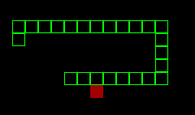

# snake_game

The snake game made with python using the pygame library

To play it you need to pip install pygame and then run main.py

_**Controls:**_

    Arrow keys or WASD to move

    Spacebar resets the game.

    Escape exits the game.
